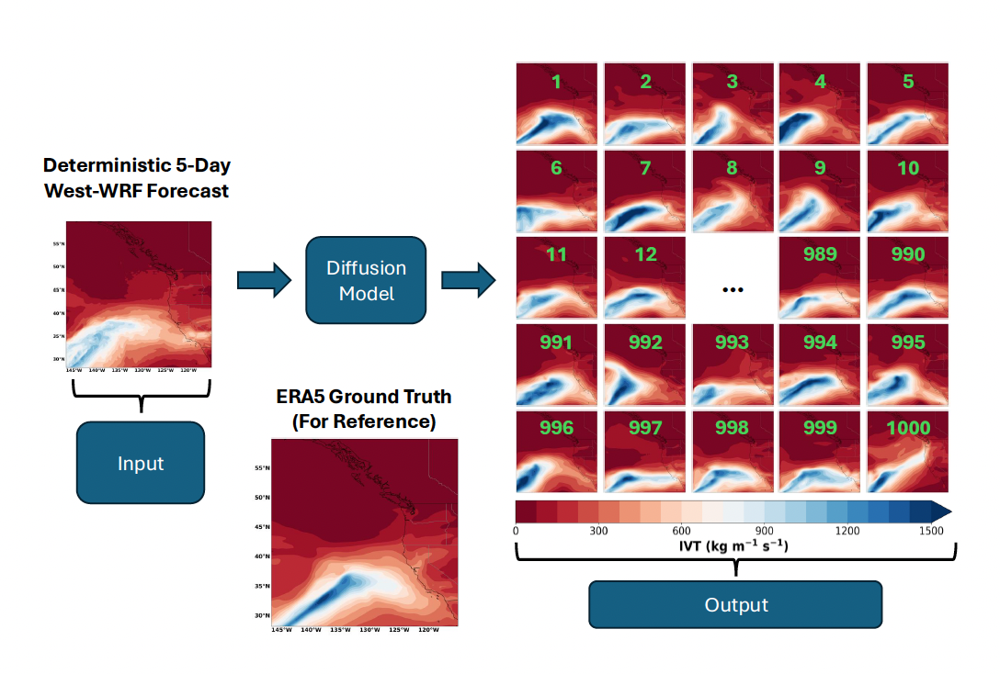

</img>

## Generating a 1000-member Ensemble of Integrated Water Vapor Transport Forecasts with Diffusion

Application of <a href="https://arxiv.org/abs/2006.11239">Denoising Diffusion Probabilistic Model</a> in Pytorch towards generating probabilistic integrated vapor transport (IVT) forecasts from deterministic forecasts. This model is trained to create a distribution of possible states of IVT when given a forecast from West-WRF. It can produce any amount of ensemble members. Pretrained models and experimental data for forecasts of 3 days, 4 days, and 5 days can be found here: <a href="https://scholar.colorado.edu/concern/datasets/3197xn88s">Dataset</a>


## Install

```bash
$ pip install denoising_diffusion_pytorch
```

## Usage
Training: launch.sh
Find best model epoch: launch-findmod.sh (pick the one that looks the best)
Inference: launch_inference.sh
Create figures: Recreate_Figures.ipynb

## Multi-GPU Training

The `Trainer` class is now equipped with <a href="https://huggingface.co/docs/accelerate/accelerator">🤗 Accelerator</a>. You can easily do multi-gpu training in two steps using their `accelerate` CLI

At the project root directory, where the training script is, run

```python
$ accelerate config
```

Then, in the same directory

```python
$ accelerate launch train.py
```

